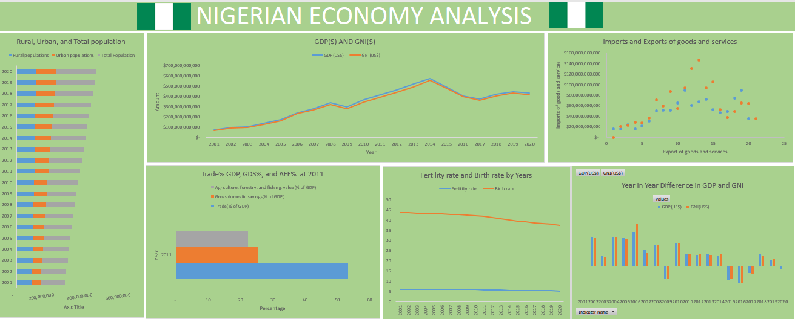

# Nigerian-Economic-Analysis

## Introduction
This project is on an assignment I was given in my training at CWW tech africa. I was given Nigeria’s Economic data from the World Bank and I admired how rich the data is as I have been trying to unfold new discoveries with a very rich dataset to practice my skills of data cleaning, analysis, and visualization using Excel and also creating a report dashboard with the dataset.

## Problem statement 
1. What is the GDP (Current US $) and  GNI (Current US $) by year?
2. What are the rural population, urban population, and population rate by year?
3. What is the fertility rate, total (births per woman) by year?
4. What is the relationship between the Import of goods (Current US $) and the Export of Goods (current US $)?
5. What is the percentage of trade (% of GDP), agriculture, forestry, and fishing, and value added (% of GDP) for the year 2011?

## Skills/Concepts Demonstrated
- Excel
- PowerPivot
- PivotTables
- Dashboard 

## Data Preparation / Cleaning:
Link to data set: [here](data.worldbank.org/country/Ng)

 
1)	The dataset was very large it has 66 columns and 999+ rows,  I was streamlined to get the following from the dataset:
-	Year from 2001 – 2020
-	Population (female)
-	Imports of goods and services (current US$)
-	Population, total
-	GNI (Current US$)
-	Rural population
-	Life expectancy at birth, total(years)
-	Trade (% of GDP)
-	Access to electricity (% of population)
-	Gross national expenditure (current US$)
-	Rural population (% of total population)
-	Fertility rate, total (births per woman)
-	Gross domestic savings (% of GDP)
-	Population, male
-	Birth rate, crude (per 1,000 people)
-	GDP (current US$)
-	Urban population
-	Air transport, freight (million ton-km)
-	Surface area (sq. k m)
-	Agriculture, forestry, and fishing, value added (% of GDP)
-	Goods imports (BoP, Current US$)

2)	Deleting the top 3 rows

3)	Filling null values with 0

4)	Remove years that isn’t 2001-2020

5)	Transpose my Data, rows to be columns, columns to be rows 

6)	Use first rows as headers

7)	Select my data from the instructions and final preprocessed data:
-	After my data cleaning and transformation I had 23 columns and 20 rows to work with
-	Made sure all my data types were correct 

8)	Format as table

## Data after cleaning 
Data Set Information:
[here](data.worldbank.org/country/Ng)

Attribute Information;
- Year: year of data
- GDP: Gross domestic product
- GNI: Gross national Income

What is GDP?
The gross domestic product (GDP) is equal to the total expenditures for all final goods and services product within the country in a stipulated period of Time
What is GNI?
Gross national income (GNI) is defined as gross domestic product, plus net receipts from abroad of compensation of employees, property income and net taxes less subsidies on production

What is the difference between GDP and GNI?
GDP looks at the production level of an economy or the total annual value of what is produced in the nation; its measures an economy’s size and growth rate.
GNI is the total dollar rate of everything produced by a country and the income its resident receive – whether it is earned at home or abroad

## ANALYSIS
1)	What is the GDP (Current US $) and GNI (Current US $) by year

Looking deeper into the GDI and GNI per year I had to compare the growth % difference from the previous year.
From the graph our GDP and GNI had a fall in the year 2009, 2015, 2016, 2019 and also 2020
And we had the best GDP and GNI ratio in the year 2006

2)	What are the rural population, urban population, and population rate by year

3)	What is the fertility rate, total (births per woman) by year

4)	What is the relationship between the Import of goods (Current US $) and the Export of Goods (current US $)

5)	What is the percentage of trade (% of GDP), agriculture, forestry, and fishing, and value added (% of GDP) for the year 2011

I created a dashboard using excel to show all of the analysis 

## Recommendation
1.	GDP looks at the production level of an economy, By enhancing productivity of labour, through training and technological catch up, the GDP per capita of Nigeria could be improved
2. Our level of import is higher than our level of exports, so we need to Increases in capital goods, labor force, technology, and human capital

